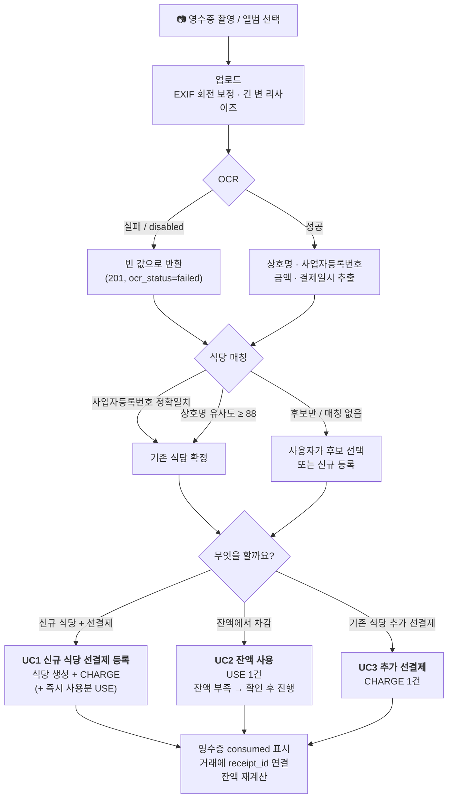

# 연구실 선결제 관리 (ssel-rest-mng)

연구실이 식당에 미리 돈을 맡겨두고(**선결제**) 그 잔액을 나눠 쓰는 방식을,
영수증 사진 한 장으로 관리하는 모바일 우선 웹앱입니다.

---

## 프로젝트 소개

### 선결제가 뭔가요?

연구실 회식·야식이 잦으면 매번 결제하고 정산하는 게 번거롭습니다.
그래서 식당에 **10만 원, 30만 원씩 미리 맡겨두고** 방문할 때마다 그 잔액에서
차감하는 방식을 씁니다. 이게 선결제(prepayment)입니다.

문제는 **잔액을 아무도 정확히 모른다**는 점입니다.

- "○○식당에 아직 얼마 남았지?" → 아무도 모름
- 식당 사장님 장부와 우리 기억이 어긋남
- 누가 언제 얼마 썼는지 추적 불가
- 다 쓴 줄 모르고 갔다가 현장에서 당황

이 앱은 그 잔액을 **원장(ledger)** 으로 관리합니다.
충전과 사용을 전부 기록으로 남기고, 잔액은 저장하지 않고 **항상 기록의 합으로 계산**합니다.
그래서 잔액과 기록이 어긋나는 일이 구조적으로 생기지 않습니다.

### 무엇을 하는 앱인가요?

식당에서 결제하고 나오면서 **영수증을 찍기만** 하면 됩니다.
자체 호스팅 Qwen 비전 모델이 상호명·사업자등록번호·금액·결제일시를 읽어내고,
사업자등록번호로 기존 식당을 자동으로 찾아서 "충전할까요 / 차감할까요"만 물어봅니다.

OCR 이 실패하거나 아예 꺼져 있어도 **수동 입력으로 모든 기능을 그대로 쓸 수 있습니다.**
OCR 은 입력을 편하게 해주는 보조 장치이지, 앱의 필수 부품이 아닙니다.

---

## 주요 기능

앱이 상정하는 실제 상황(유스케이스)은 다음과 같습니다.

| # | 상황 | 앱에서 하는 일 |
|---|---|---|
| **UC1** | **신규 식당 선결제 등록**<br>처음 가는 식당에 30만 원을 맡기고 오늘 4만 원을 썼다 | `/scan` 에서 영수증 촬영 → 매칭 결과 없음 → `신규 식당으로 등록` → 충전 30만 원 + 즉시 사용 4만 원을 **한 번에** 기록 (식당 생성 + CHARGE + USE 가 하나의 트랜잭션) |
| **UC2** | **잔액 사용**<br>이미 선결제된 식당에서 2만 5천 원을 썼다 | 영수증 촬영 → 사업자등록번호로 식당 자동 확정 → `잔액에서 차감하기`. 잔액이 부족하면 경고 후 확인하면 음수 잔액도 허용 (외상 상황을 숨기지 않는다) |
| **UC3** | **추가 선결제**<br>잔액이 떨어져서 20만 원을 더 맡겼다 | 영수증(또는 입금 내역) 촬영 → 기존 식당 확정 → `선결제 충전하기` |
| **UC4** | **웹 관리**<br>"지금 어디에 얼마 남았지?" | `/` 홈에서 선결제 식당 목록 + 총 잔액을 한눈에. `/ledger` 에서 전체 원장 필터·검색·CSV 내려받기, `/stats` 에서 월별 추이 |
| **UC5** | **이미 선결제된 식당 백필 등록**<br>앱 도입 전부터 맡겨둔 돈이 있다 | `/restaurants/new` 에서 `+ 식당 직접 등록` → `초기 잔액` 을 입력하면 `"초기 잔액 등록"` 메모가 붙은 CHARGE 거래가 자동 생성된다. 영수증 없이도 과거 잔액을 그대로 이어받을 수 있다 |
| **UC6** | **선결제 식당 목록 화면**<br>방문 전에 잔액 확인 | 홈 화면이 곧 목록. 잔액 내림차순 기본 정렬, 상호명·주소·사업자등록번호 부분검색, `잔액 부족` 배지(기준: `LOW_BALANCE_THRESHOLD`), 총 잔액 합계 표시 |

그 밖에

- **영수증 없이 기록** — `/use` 에서 사진 없이 사용 내역만 입력
- **기록 취소(void)** — 거래는 삭제하지 않고 사유를 남겨 무효화. 감사 추적이 남는다
- **중복 영수증 경고** — 같은 사업자등록번호·금액·결제일(±1일) 영수증이 이미 처리됐으면 알려준다 (차단은 하지 않음)
- **초대코드 가입** — 연구실 구성원만 가입. 첫 가입자는 자동으로 관리자
- **CSV 내려받기** — UTF-8 BOM 이라 엑셀에서 한글이 깨지지 않는다
- **모바일 PWA** — 홈 화면에 추가해서 앱처럼 사용 (HTTPS 필요)

---

## 기술 스택

| 영역 | 사용 기술 |
|---|---|
| 백엔드 | Python 3.13 · FastAPI · SQLAlchemy 2.0 · Alembic · Pydantic v2 |
| DB | SQLite (기본, 파일 하나) / PostgreSQL 전환 가능 |
| 인증 | JWT(PyJWT) + httpOnly 쿠키 · bcrypt |
| 프론트엔드 | Vue 3 · Vite · Vuetify 3 · Pinia · vue-router · axios |
| 영수증 OCR | 자체 호스팅 Qwen 비전 모델 (OpenAI 호환 API) · Pillow 전처리 |
| 상호명 매칭 | 사업자등록번호 정확일치 + rapidfuzz 퍼지 매칭 |
| 배포 | Docker 멀티스테이지 단일 이미지 · docker compose |

설계상의 선택 몇 가지

- **잔액 컬럼이 없다.** 원장 합계로만 계산한다 (아래 [데이터 모델 요약](#데이터-모델-요약) 참고)
- **단일 포트·단일 컨테이너.** FastAPI 가 `frontend/dist` 를 직접 서빙하므로 nginx 가 필요 없다
- **금액은 정수 원 단위.** 부동소수점을 쓰지 않는다
- **시간은 DB=naive UTC, 응답=ISO+00:00, 요청의 naive 값=KST 벽시계** 로 통일

---

## 화면 구성

| 경로 | 화면 | 설명 |
|---|---|---|
| `/login` | 로그인 | 로그인 + 초대코드 가입 (탭) |
| `/` | 홈 | **선결제 식당 목록** + 총 잔액 + CTA 2개 |
| `/scan` | 영수증 스캔 | 영수증 촬영 → OCR → 매칭 → 충전/사용 확정 |
| `/use` | 수동 사용 기록 | 영수증 없이 사용 기록 |
| `/restaurants/new` | 식당 직접 등록 | 기존 선결제 백필 (초기 잔액 입력) |
| `/restaurants/:id` | 식당 상세 | 잔액 + 거래 타임라인 + 충전/차감/수정 |
| `/ledger` | 전체 원장 | 필터 + 기록 취소 + CSV 내려받기 |
| `/stats` | 통계 | 월별 추이 · 식당별 · 사용자별 |
| `/admin` | 사용자 관리 | 관리자 전용 |

미인증 상태로 접근하면 `/login?redirect=<원래경로>` 로 보냅니다.
`/admin` 은 관리자가 아니면 홈으로 돌려보냅니다.

API 문서는 서버가 뜬 뒤 `/api/docs` (Swagger UI) 에서 볼 수 있습니다.

---

## 빠른 시작

### 개발 환경

```bash
git clone <이 저장소 URL> ssel-rest-mng
cd ssel-rest-mng
cp .env.example .env        # 값은 그대로 둬도 개발은 돌아갑니다
```

**백엔드** (터미널 1)

```bash
cd backend
python -m venv .venv
.venv\Scripts\activate          # Windows PowerShell:  .venv\Scripts\Activate.ps1
# macOS/Linux:  source .venv/bin/activate
pip install -r requirements-dev.txt

alembic upgrade head            # 스키마 생성
python scripts/seed.py --demo   # 관리자 계정 + 예시 데이터
uvicorn app.main:app --reload --port 8000
```

**프론트엔드** (터미널 2)

```bash
cd frontend
npm install
npm run dev                     # http://localhost:5173  (/api → :8000 프록시)
```

브라우저에서 <http://localhost:5173> 을 열고, `.env` 의 `ADMIN_EMAIL` / `ADMIN_PASSWORD`
로 로그인합니다. 아직 계정이 없다면 초대코드(`INVITE_CODE`)로 가입하세요 —
**첫 가입자는 자동으로 관리자**가 됩니다.

**테스트**

```bash
cd backend
.venv\Scripts\python.exe -m pytest      # macOS/Linux: python -m pytest
```

### 운영 배포 (Docker)

```bash
cp .env.example .env
# .env 를 열어 JWT_SECRET / INVITE_CODE / OCR_BASE_URL / ADMIN_* 을 채운다
#   JWT_SECRET 생성:  openssl rand -hex 32

docker compose up -d --build
docker compose logs -f app
```

→ <http://서버주소:8000> 접속. 컨테이너가 뜰 때 `alembic upgrade head` 를 자동 실행하므로
새 서버에서도 별도 마이그레이션 명령이 필요 없습니다.

자세한 절차(HTTPS, 백업, 업데이트, 트러블슈팅)는 **[docs/DEPLOY.md](docs/DEPLOY.md)** 를 보세요.
인터페이스 규약은 **[docs/CONTRACT.md](docs/CONTRACT.md)** 에 있습니다.

---

## 환경변수

`.env.example` 을 `.env` 로 복사해서 채웁니다. `.env` 는 커밋되지 않습니다.

### 앱 / DB

| 키 | 의미 | 기본값 |
|---|---|---|
| `ENVIRONMENT` | `development` / `production`. production 인데 `JWT_SECRET` 이 기본값이면 서버가 기동 로그에 경고를 남긴다 | `development` |
| `DATABASE_URL` | 비워두면 `backend/data/app.db` (SQLite) 자동 사용. PostgreSQL 예: `postgresql+psycopg://user:pw@host:5432/dbname` | *(비어 있음)* |

### 인증

| 키 | 의미 | 기본값 |
|---|---|---|
| `JWT_SECRET` | 토큰 서명 키. **운영 배포 전 반드시 교체** (`openssl rand -hex 32`) | `dev-only-insecure-secret` |
| `JWT_EXPIRE_MINUTES` | 로그인 유지 기간(분). `43200` = 30일 | `43200` |
| `COOKIE_SECURE` | HTTPS 로 서비스할 때만 `true`. **HTTP 배포에서 `true` 면 로그인이 안 된다** | `false` |
| `INVITE_CODE` | 회원가입에 필요한 초대코드. 연구실 구성원에게만 공유 | `ssel-lab` |
| `ADMIN_EMAIL` | `scripts/seed.py` 가 만드는 최초 관리자 이메일 | `admin@example.com` |
| `ADMIN_PASSWORD` | 최초 관리자 비밀번호 (8자 이상). 이미 계정이 있으면 **덮어쓰지 않는다** | `admin1234` |
| `ADMIN_NAME` | 최초 관리자 표시 이름 | `관리자` |

### 영수증 OCR

| 키 | 의미 | 기본값 |
|---|---|---|
| `OCR_PROVIDER` | `qwen_vl`(이미지 직접 전송, 권장) / `qwen_text`(비전 미지원 폴백) / `disabled`(OCR 끄기) | `qwen_vl` |
| `OCR_BASE_URL` | 자체 호스팅 모델의 **OpenAI 호환 베이스 URL**. 예: `http://<내부주소>:8000/v1`. 비워두면 OCR 자동 비활성 | *(비어 있음)* |
| `OCR_MODEL` | 요청에 실어 보낼 모델 이름 | `Qwen3.6-27B` |
| `OCR_API_KEY` | 서버가 API 키를 요구하지 않으면 비워둔다 | *(비어 있음)* |
| `OCR_TIMEOUT` | 추론 타임아웃(초). 큰 모델·CPU 추론이면 늘린다 | `120` |
| `OCR_MAX_IMAGE_PX` | 전송 전 이미지 긴 변을 이 픽셀로 축소. 줄이면 빨라지고 늘리면 잔글씨 인식률이 오른다 | `1600` |
| `OCR_USE_GUIDED_JSON` | vLLM `guided_json`(구조화 출력)을 지원하는 서버면 `true` | `false` |

### 업로드 / 표시 / CORS

| 키 | 의미 | 기본값 |
|---|---|---|
| `MAX_UPLOAD_MB` | 영수증 이미지 최대 크기(MB). 초과 시 413 | `15` |
| `LOW_BALANCE_THRESHOLD` | 잔액이 이 금액 미만이면 `잔액 부족` 배지 표시(원). 음수 잔액도 포함 | `30000` |
| `CORS_ORIGINS` | 개발용 허용 오리진(콤마 구분). Vite 프록시를 쓰면 비워둔다 | *(비어 있음)* |

> `docker-compose.yml` 만 쓰는 추가 키
> - `PORT` — 호스트에 노출할 포트 (기본 `8000`). 컨테이너 내부는 항상 `8000`
> - `TZ` — 컨테이너 타임존 (기본 `Asia/Seoul`)
>
> 코드 기본값으로만 존재하고 보통 건드리지 않는 키: `APP_NAME`, `JWT_ALGORITHM`,
> `COOKIE_NAME`(`ssel_token`), `COOKIE_SAMESITE`(`lax`).

---

## 영수증 OCR 설정

이 앱은 상용 OCR API 를 쓰지 않습니다. **연구실이 직접 띄운 Qwen 모델**에
OpenAI 호환 규격으로 요청합니다. vLLM, SGLang, Ollama(OpenAI 호환 모드) 등
`POST /chat/completions` 를 제공하는 서버면 모두 붙습니다.

### 1) 엔드포인트 설정

`.env` 의 `OCR_BASE_URL` 에 **`/v1` 까지 포함한 베이스 URL** 을 적습니다.

```bash
OCR_PROVIDER=qwen_vl
OCR_BASE_URL=http://<연구실-서버-주소>:<포트>/v1
OCR_MODEL=<서버에 로드된 모델 이름>
OCR_API_KEY=            # 서버가 요구하지 않으면 비워둠
```

> ⚠️ 내부 주소는 **`.env` 에만** 적습니다. 코드·문서·커밋 메시지에 남기지 마세요.

### 2) 연결 확인 — `scripts/ocr_smoke.py`

앱을 띄우기 전에 이 스크립트로 먼저 검증하세요. **연구실 Qwen 서버가 비전 입력을
지원하는지 판별하는 관문**입니다.

```bash
cd backend

# 연결만 확인 (이미지 없이 텍스트 프롬프트)
python scripts/ocr_smoke.py --no-image

# 실제 영수증 사진으로 확인
python scripts/ocr_smoke.py ~/Downloads/receipt.jpg
```

출력에 설정값(주소는 **마스킹**됨), 엔드포인트 도달 여부, 파싱된 JSON,
소요 시간(ms), 모델 원문(일부)이 표시됩니다.
성공하면 종료코드 `0`, 실패하면 `1` 과 함께 **다음에 뭘 시도할지 한국어로 안내**합니다.

- 서버가 **이미지 입력을 거부**하면 → 텍스트 전용 배포입니다. `OCR_PROVIDER=qwen_text` 로 바꾸세요
- 타임아웃이면 → `OCR_TIMEOUT` 을 늘리거나 `OCR_MAX_IMAGE_PX` 를 줄이세요
- 도달 자체가 안 되면 → 주소/포트/`/v1` 경로, 방화벽, 서버 기동 상태를 확인하세요

### 3) OCR 없이 쓰기

```bash
OCR_PROVIDER=disabled
```

**앱은 100% 그대로 쓸 수 있습니다.** 영수증을 올리면 OCR 결과가 빈 값으로 오고,
사용자가 상호명·금액·날짜를 직접 입력해서 확정합니다. 영수증 이미지는 그대로
저장·조회되므로 증빙 기능도 유지됩니다. `/use` 화면은 애초에 사진 없이 동작합니다.

OCR 이 실패해도 업로드 API 는 **201 을 반환**합니다. 즉 OCR 장애가 앱을 멈추게 하지 않습니다.

### 영수증 스캔 플로우



같은 흐름을 텍스트로 보면:

```
  영수증 촬영
      │
      ▼
  업로드(EXIF 보정·리사이즈) ──▶ OCR ──┬─ 성공 ─▶ 파싱값
      │                                └─ 실패 ─▶ 빈 값 (201, 수동 입력)
      ▼
  식당 매칭  ─── 사업자등록번호 일치 ──▶ 확정
             ─── 상호명 유사도 ≥ 88 ──▶ 확정
             ─── 그 외 ────────────────▶ 후보 제시 / 신규
      │
      ▼
  확정(confirm)  ┌── UC1  신규 식당 등록 + 충전 (+ 즉시 사용)
                 ├── UC2  잔액 차감 (부족하면 확인 후 음수 허용)
                 └── UC3  기존 식당 추가 충전
      │
      ▼
  영수증 consumed 표시 + 거래에 receipt_id 연결  (재사용 시 409)
```

---

## 데이터 모델 요약

테이블은 네 개입니다: `users`, `restaurants`, `receipts`, `transactions`.

### 핵심 원칙: 잔액은 저장하지 않는다

```
balance = Σ(CHARGE) − Σ(USE) + Σ(ADJUST)      (voided_at IS NULL 인 거래만)
```

`restaurants` 테이블에는 **`balance` 컬럼이 없습니다.** 잔액은 언제나 `transactions`
원장에서 계산합니다. 이유는 단순합니다.

- 잔액 컬럼과 기록이 어긋나는 사고가 **원천적으로 불가능**하다
- "왜 이 금액이 됐는지" 를 항상 기록으로 설명할 수 있다
- 과거 시점의 잔액을 그대로 재현할 수 있다
- 잘못 입력한 기록을 되돌려도 잔액이 자동으로 맞는다

### 거래 유형

| 유형 | 부호 | 의미 |
|---|---|---|
| `CHARGE` | `+amount` | 선결제 충전 (양수) |
| `USE` | `−amount` | 사용/차감 (양수로 저장하고 계산 시 뺀다) |
| `ADJUST` | `+amount` (부호 포함) | 정정. 0 은 허용하지 않는다 |

### 삭제하지 않는다

- **거래**는 지우지 않고 `void` 처리합니다. `voided_at`, `voided_by`, `void_reason`
  (사유 필수)을 남기고, 잔액 계산에서만 빠집니다. 한 번 void 한 거래를 다시 void 하면 409
- **식당**은 지우지 않고 `is_archived=true` 로 숨깁니다. 거래 이력은 그대로 남습니다
- **영수증**은 `confirm` 되면 `consumed_at` 이 찍혀 재사용이 막힙니다 (같은 영수증으로 두 번 충전 방지)

### 잔액이 음수가 될 수 있습니다

기본적으로 잔액을 넘는 `USE` 는 409 로 거부하지만, 사용자가 확인하면
(`allow_negative=true`) 음수 잔액을 허용합니다. 실제로 외상이 생긴 상황을
장부에서 숨기지 않는 편이 정확하기 때문입니다.

### 사업자등록번호

저장·비교 모두 **숫자 10자리로 정규화**합니다 (`123-45-67890` → `1234567890`).
하이픈은 화면에 보여줄 때만 붙입니다. 이 값이 영수증 → 식당 매칭의 1순위 키입니다.

---

## 보안 주의

> ### ⚠️ 공개 저장소입니다. `.env`·내부 IP·시크릿을 커밋하지 마세요.

지켜야 할 것

- **`.env` 는 절대 커밋하지 않습니다.** `.gitignore` 에 등록돼 있지만,
  `git add -f` 나 `git add -A` 후 실수로 스테이징되는 경우를 항상 확인하세요
- **내부 IP·호스트명·포트를 코드·문서·이슈·커밋 메시지에 적지 않습니다.**
  `OCR_BASE_URL` 같은 값은 `.env` 에만 존재해야 합니다.
  `scripts/ocr_smoke.py` 는 진단 출력에서도 주소를 마스킹합니다
- **`data/`, `backend/data/` 는 gitignore 되어 있고, 그래야 합니다.**
  이 디렉터리에는 **구성원 계정(이메일·bcrypt 해시)** 이 담긴 SQLite DB 와
  **영수증 이미지 원본**(카드번호 일부·결제정보가 찍혀 있을 수 있음)이 들어갑니다.
  백업 파일도 저장소 안에 두지 마세요
- **`JWT_SECRET` 은 배포마다 새로 만듭니다.** `openssl rand -hex 32`.
  기본값 `dev-only-insecure-secret` 으로 운영하면 누구나 토큰을 위조할 수 있습니다
- **`INVITE_CODE` 는 연구실 안에서만 공유합니다.** 이게 유일한 가입 장벽입니다
- **HTTP 배포에서는 `COOKIE_SECURE=false`**, HTTPS 를 붙였으면 `true` 로 바꿉니다
- 이미지를 남에게 넘길 일이 있다면 `.dockerignore` 가 `.env` 와 `backend/data/`
  를 제외하는지 확인하세요 (기본 설정되어 있습니다)

실수로 시크릿을 커밋했다면: 값을 **즉시 교체**하고(히스토리에서 지우는 것보다 우선),
그다음에 히스토리 정리를 고려하세요.

---

## 라이선스

MIT License

```
Copyright (c) 2026 ssel-rest-mng contributors

Permission is hereby granted, free of charge, to any person obtaining a copy
of this software and associated documentation files (the "Software"), to deal
in the Software without restriction, including without limitation the rights
to use, copy, modify, merge, publish, distribute, sublicense, and/or sell
copies of the Software, and to permit persons to whom the Software is
furnished to do so, subject to the following conditions:

The above copyright notice and this permission notice shall be included in all
copies or substantial portions of the Software.

THE SOFTWARE IS PROVIDED "AS IS", WITHOUT WARRANTY OF ANY KIND, EXPRESS OR
IMPLIED, INCLUDING BUT NOT LIMITED TO THE WARRANTIES OF MERCHANTABILITY,
FITNESS FOR A PARTICULAR PURPOSE AND NONINFRINGEMENT. IN NO EVENT SHALL THE
AUTHORS OR COPYRIGHT HOLDERS BE LIABLE FOR ANY CLAIM, DAMAGES OR OTHER
LIABILITY, WHETHER IN AN ACTION OF CONTRACT, TORT OR OTHERWISE, ARISING FROM,
OUT OF OR IN CONNECTION WITH THE SOFTWARE OR THE USE OR OTHER DEALINGS IN THE
SOFTWARE.
```
